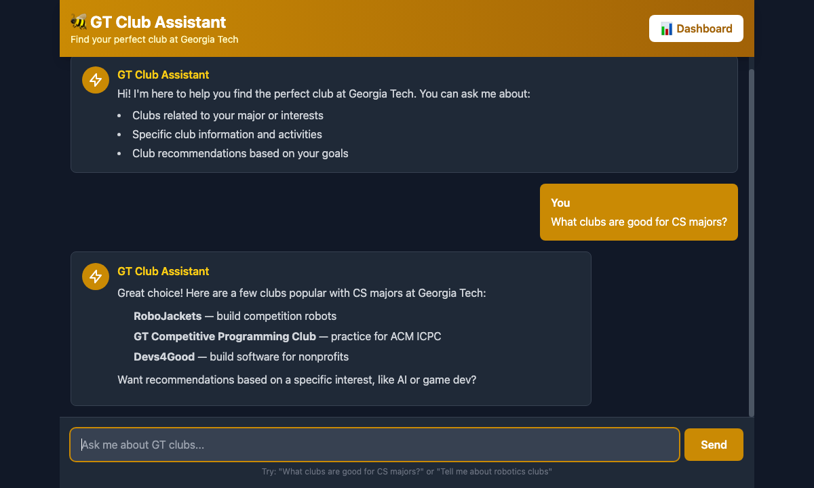

# GT Club Assistant

A Flask backend that powers an AI chatbot for discovering student clubs at Georgia Tech. It combines a MongoDB-backed club directory, a Gemini-powered chat assistant with conversation memory, JWT authentication, and a lightweight analytics dashboard.



## Features

- 🤖 **AI chat assistant** — ask about clubs in natural language, powered by Google Gemini, with per-session conversation memory stored in MongoDB
- 🔍 **Club directory API** — full CRUD endpoints backed by MongoDB
- 🔐 **JWT authentication** — register/login with bcrypt-hashed passwords
- 📊 **Analytics dashboard** — membership and event-attendance charts rendered with Chart.js
- 💬 **Chat UI** — a simple, responsive front end with Markdown rendering and syntax highlighting

## Setup

1. **Clone the repository**
   ```bash
   git clone https://github.com/sailalithkanumuri8/gt_chatbot_backend.git
   cd gt_chatbot_backend
   ```

2. **Create a virtual environment**
   ```bash
   python3 -m venv .venv
   source .venv/bin/activate  # On Windows: .venv\Scripts\activate
   ```

3. **Install dependencies**
   ```bash
   pip install -r requirements.txt
   ```

4. **Create a `.env` file**
   ```bash
   MONGODB_CLIENT=your_mongodb_connection_string_here
   GEMINI_API_KEY=your_gemini_api_key_here
   JWT_SECRET_KEY=your_jwt_secret_here
   ```

## Usage

1. **Upload sample data to MongoDB**
   ```bash
   python upload_clubs.py
   ```

2. **Start the Flask server**
   ```bash
   python hello.py
   ```

3. **Open the app**
   - Chat UI: [http://localhost:8001](http://localhost:8001)
   - Dashboard: [http://localhost:8001/dashboard](http://localhost:8001/dashboard)

## API Endpoints

| Method | Endpoint | Description |
| --- | --- | --- |
| GET | `/clubs` | Get all clubs |
| GET | `/clubs/<club_name>` | Get clubs matching a name (case-insensitive) |
| POST | `/clubs` | Create a new club |
| PUT | `/clubs/<club_name>` | Update a club by name |
| DELETE | `/clubs/<club_name>` | Delete clubs by name |
| POST | `/chat` | Send a message to the AI assistant |
| POST | `/auth/register` | Register a new user |
| POST | `/auth/login` | Log in and receive a JWT |
| GET | `/auth/me` | Get the current authenticated user |
| GET | `/api/members_by_department` | Membership totals by department |
| GET | `/api/events_summary` | Club event/attendance summary |
| GET | `/dashboard` | Analytics dashboard UI |

## Project Structure

```
├── hello.py             # Flask application with all routes
├── upload_clubs.py      # Script to upload CSV data to MongoDB
├── sample_clubs.csv     # Sample club data
├── templates/index.html # Chat UI
├── static/images/       # Static assets
├── tests/                # Test suite
└── .env                 # MongoDB/Gemini/JWT config (create this file)
```

## Tech Stack

Flask · MongoDB (PyMongo) · Google Gemini API · JWT + bcrypt · Chart.js · Tailwind CSS
